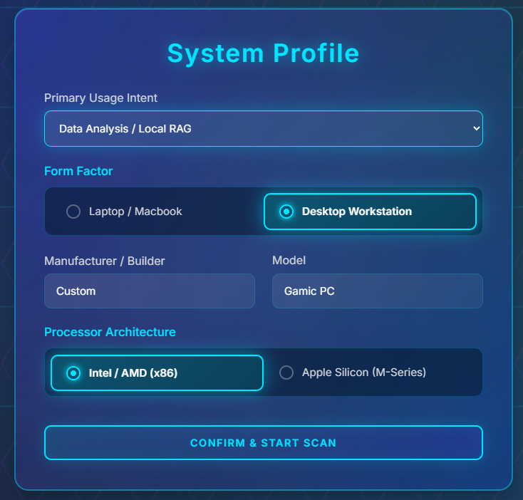
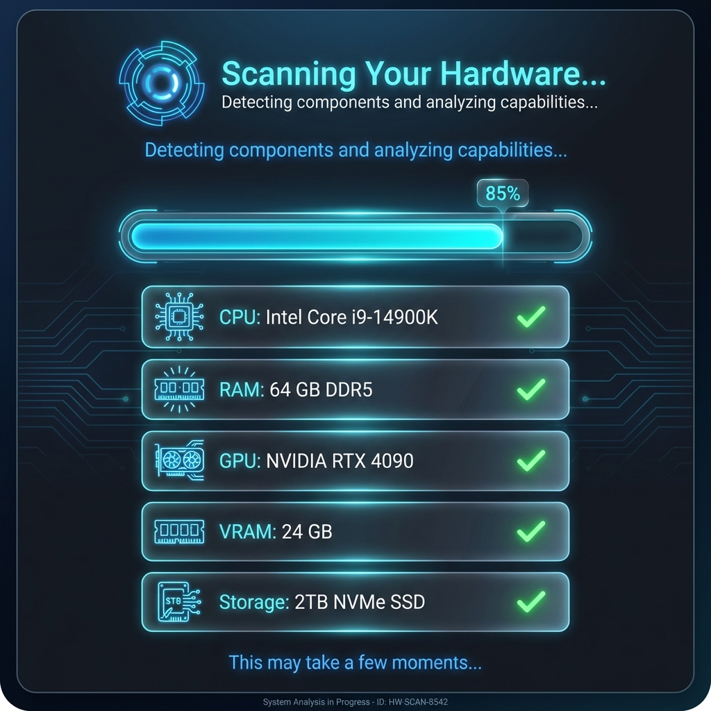
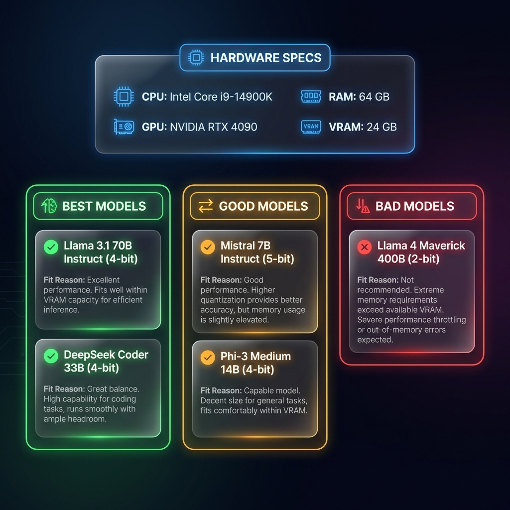

# 🤖 Insight AI

> **Find the perfect Large Language Model for your hardware**

A beautiful desktop application that analyzes your computer's specifications and recommends which LLM models you can run locally. Built with Electron, React, and modern web technologies.



## ✨ Features

- **🔍 Smart Hardware Detection** - Automatically scans CPU, RAM, GPU, VRAM, and storage
- **🎯 Hardware-Aware Recommendations** - Evidence-based algorithm that understands:
  - Apple Silicon unified memory architecture
  - Windows desktop vs laptop thermal differences  
  - NVIDIA GPU VRAM requirements
  - CPU-only system limitations
- **📊 Per-Component Status Indicators** - Real-time component scanning with visual feedback
- **🎨 5 Usage Intents** - Chat, Coding, Creative Writing, Data Analysis, Vision/Image Processing
- **🔒 100% Offline & Private** - No data leaves your machine, ever
- **📱 Modern UI** - Glassmorphism design with smooth animations
- **60+ Models** - Comprehensive database including Llama, Qwen, DeepSeek, LLaVA, and more

## 📸 Screenshots

### Hardware Scanning


### Model Recommendations


## 🚀 Quick Start

### Prerequisites
- **Node.js** 18+ and npm
- **Windows** 10/11 or **macOS** 12+

### Installation

```bash
# Clone the repository
git clone https://github.com/debarun1234/llm-model-eligibility-checker.git
cd llm-model-eligibility-checker

# Install dependencies
npm install

# Run in development mode
npm run dev
```

### Build for Production

```bash
# Build the application
npm run build

# Package as desktop app
npm run electron
```

## 📖 Documentation

- **[User Guide](docs/USER_GUIDE.md)** - Complete walkthrough with step-by-step instructions
- **[Architecture Overview](docs/ARCHITECTURE.md)** - Technical design and implementation details
- **[Recommendation Engine](docs/RECOMMENDATION_ENGINE.md)** - How the scoring algorithm works

## 🎯 How It Works

1. **Enter Your System Info** - Device type, manufacturer, processor architecture, and usage intent
2. **Scan Hardware** - Detects CPU, RAM, GPU, VRAM, and storage automatically
3. **Get Recommendations** - Models categorized as Best/Good/Bad based on your hardware

### Example Recommendations

**Apple Silicon (M3 Max, 96GB RAM)**:
- ✅ **Best**: Llama 3.1 70B, DeepSeek R1 47B, Qwen VL 72B
- ✓ **Good**: Llama 4 Scout 17B, Mistral 7B, LLaVA 1.6 34B

**Windows Desktop (RTX 4090, 24GB VRAM, 64GB RAM)**:
- ✅ **Best**: Llama 3.1 70B (4-bit), DeepSeek Coder 33B
-  ✓ **Good**: Qwen 3 VL 32B, Phi-3 Vision 14B

**Windows Laptop (RTX 4060, 8GB VRAM, 32GB RAM)**:
- ✓ **Good**: Llama 3.2 13B, Mistral 7B, Phi-3 Small
- ⚠️ **Bad**: Llama 3.1 70B (will be very slow)

## 🔬 Technology Stack

- **Frontend**: React 18, Framer Motion
- **Desktop**: Electron, Node.js
- **Hardware Detection**: systeminformation library
- **Build Tool**: Vite
- **Styling**: CSS with glassmorphism effects

## 🌟 Key Features Explained

### Hardware-Aware Scoring
Unlike simple requirement checkers, this app understands:
- **Unified Memory** (Apple Silicon) vs **Discrete VRAM** (NVIDIA GPUs)
- **Desktop sustained performance** vs **Laptop thermal throttling**
- **GPU acceleration** vs **CPU-only inference** speed differences

### Vision Model Support
Select "Image Processing / Vision Tasks" to see only multimodal models:
- LLaVA 1.6 (13B, 34B)
- Qwen VL (all variants)
- Phi-3 Vision
- Moondream, BakLLaVA

### Anti-Impersonation Validation
The app compares your manual input against detected hardware to prevent false recommendations.

## 🔐 Privacy & Security

- ✅ **100% Offline** - No internet connection required
- ✅ **No Telemetry** - Zero data collection or tracking
- ✅ **Local Processing** - All analysis happens on your device
- ✅ **Open Source** - Fully transparent code

## 🤝 Contributing

Contributions are welcome! Please feel free to submit a Pull Request.

### Adding New Models

Edit `src/data/models.json`:

```json
{
  "id": "my-new-model",
  "name": "Model Name (4-bit)",
  "family": "Model Family",
  "size_params": "13B",
  "quantization": "Q4_K_M",
  "req_vram_gb": 10,
  "req_ram_gb": 16,
  "description": "Model description",
  "tags": ["chat", "general"],
  "min_score": 50
}
```

## 📝 License

MIT License - see [LICENSE](LICENSE) file for details

## 🙏 Credits

- **Hardware Detection**: [systeminformation](https://github.com/sebhildebrandt/systeminformation)
- **Model Database**: Curated from HuggingFace and community sources
- **Icons & Design**: Custom glassmorphism UI with Framer Motion

## 📬 Contact

- **GitHub**: [@debarun1234](https://github.com/debarun1234)
- **Issues**: [Report a bug](https://github.com/debarun1234/llm-model-eligibility-checker/issues)

---

**Note**: This tool recommends models based on hardware specifications. Actual performance may vary based on model quantization, context length, and other  factors. Always test models on your specific hardware.

## ⭐ Star this repo if you find it useful!
